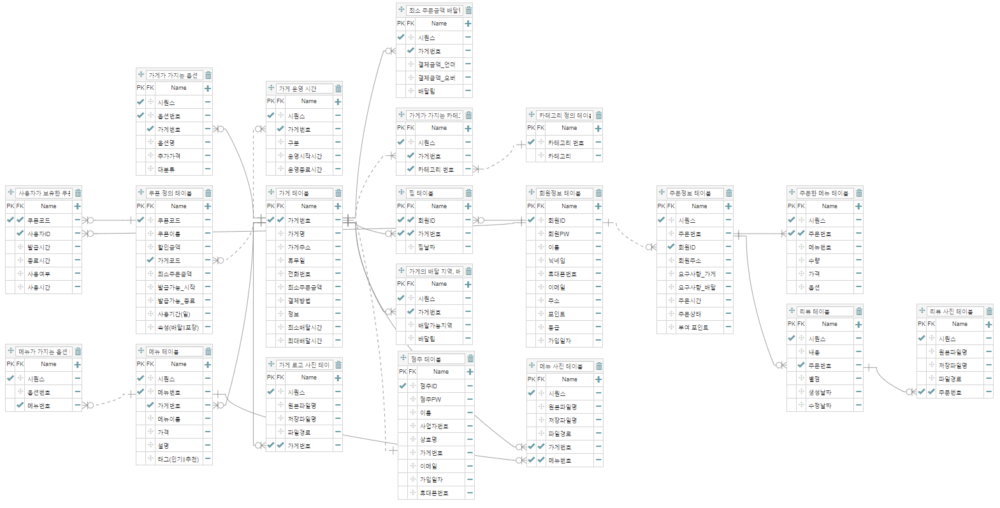

# 2022년 Rising Camp 5기 Server E반
## 배달의 민족 클론 코딩 프로젝트

## 개요

일상 생활에서 가장 많이 사용하는 애플리케이션 중 하나인 배달의 민족을 클론 코딩하면서<br/> 
서버에 대한 역량을 키워보고자 진행한 프로젝트이다.  
DB 설계, AWS 서버 생성 및 도메인 연결, HTTPS 적용, API 설계, 로그인 인증 과정을 진행하였다.

## 개발 환경
```
* Server : AWS EC2
* RDBMS : AWS RDS Mysql 8.0.28
* IDE :  Intellij, DataGrip
* Backend Server : Spring Boot
* Api Test Tool : Insomnia
* Api : KAKAO LOGIN API
```

## 설계

### DB 설계
<br/>

링크 -> [ERD](https://aquerytool.com/aquerymain/index/?rurl=4e0d50a9-1305-4267-ba52-edc547870fa4)<br/>
패스워드 : 17a6dn <br/>

### API 명세서<br/>

링크 -> [API 명세서](https://docs.google.com/spreadsheets/d/1sGsCyxm9wlEmrYxr6B_MxS8FlWkzNo8Fp6qbodJkLU8/edit?usp=sharing)<br/>

## 적용 기술

1. AWS EC2, AWS RDS MySQL
2. DNS 설정 및 HTTPS 적용
3. Spring Boot, JdbcTemplate
4. RESTful API
5. JWT, OAuth 2.0 (Kakao Login API)

## 기능 및 테스트

Notion에서 확인 가능 -> [Notion](https://giri-space.notion.site/2-REST-API-e55c6ad8832449ceadbe83bf495ff3f4)

## ✨License
- 본 템플릿의 소유권은 소프트스퀘어드에 있습니다. 본 자료에 대한 상업적 이용 및 무단 복제, 배포 및 변경을 원칙적으로 금지하며 이를 위반할 때에는 형사처벌을 받을 수 있습니다.
